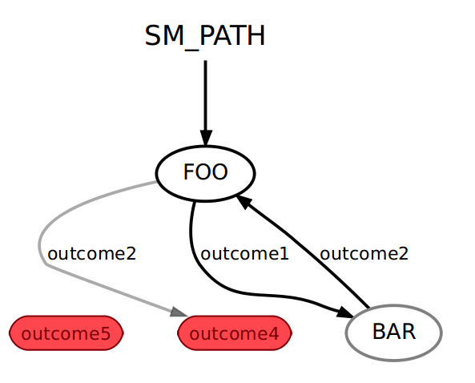

1. 简介
Smach代表"状态机"，它是一种基于python的强大的、可伸缩的分级状态机库。Smach库不依赖于ROS，并且可以在任何Python项目中使用。
编写一个简单的Smach状态机非常简单，同时，Smach允许你设计、维护和调试大型的、复杂的层次结构状态机。
2. 创建一个状态机
创建一个Smach状态机之前，首先需要创建一组状态机，然后添加这些状态机到状态机容器。
2.1 创建一个状态
创建一个状态，只需从"State"基类继承，并实现"State.execute(userdata)"方法:
```python
class Foo(smach.State):
     def __init__(self, outcomes=['outcome1', 'outcome2']):
       # 你的状态在这里进行初始化

     def execute(self, userdata):
        # 你的状态在这里运行
        if xxxx:
            return 'outcome1'
        else:
            return 'outcome2'
```
在__init__方法中初始化状态： 1.可以在这个方法中配置一些初始值，可能是一些参数、列表等。避免在__init__中做过多的业务逻辑运算。
                          2.官方文档提到不建议在init使用阻塞,等待其他系统或外部资源的初始化（例如数据库连接、外部设备的响应等）,因为会影响初始化和启动,也不便于调试分析,导致面向对象混乱.阻塞操作应当放在execute;同时,官方文档原文:"如果你需要等待系统的其他部分启动，请从单独的线程执行此操作。"
在execute方法中执行状态： 可以根据某些条件（例如if xxxx:）来执行不同的操作或判断，进而决定返回哪一个outcome。例如，如果条件满足，返回'outcome1'，否则返回'outcome2'。
选择在execute方法中执行阻塞,便于程序调试分析,便于逻辑控制,便于清晰划分状态机的阶段模块
outcome定义状态过渡： 返回的outcome会告诉状态机如何过渡到下一个状态。比如，返回'outcome1'可能会导致状态机进入下一个状态A，而返回'outcome2'可能会导致状态机进入状态B。
2.2 向状态机添加状态
状态机是容纳多个状态的容器。当向状态机容器添加状态时，需要指定状态之间的转换。
```python
sm = smach.StateMachine(outcomes=['outcome4','outcome5'])
  with sm:
     smach.StateMachine.add('FOO', Foo(),
                            transitions={'outcome1':'BAR',
                                         'outcome2':'outcome4'})
     smach.StateMachine.add('BAR', Bar(),
                            transitions={'outcome2':'FOO'})
```


